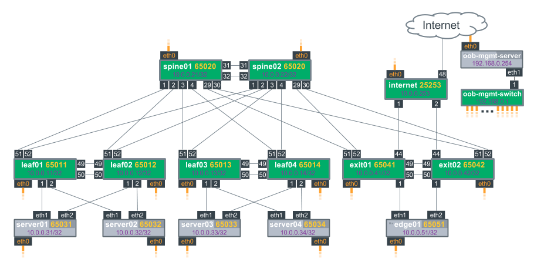

# Cumulus Linux Demo Framework

**[See the Layer 3 IP addressing on the Out of Band Network](./documentation/ipam.md)**

Welcome to the Cumulus Linux Demo Framework, which provides virtual demos of features and 
configurations with Cumulus Linux. Follow the [Prerequisites and Getting Started](#prerequisites-and-getting-started) 
instructions below to get started.

## Table of Conents

* [Prerequisites and Getting Started](#prerequisites-and-getting-started)
  * [Windows](./documentation/windows)
  * [MacOS](./documentation/macos/)
  * [Linux (Ubuntu 16.04)](./documentation/linux)
* [Available Demos](#available-demos)
* [Frequently Asked Questions](#frequently-asked-questions)
  * [What is CLdemo-Vagrant?](#what-is-cldemo-vagrant)
  * [What is the Reference Topology?](#what-is-the-reference-topology)
  * [What is Cumulus Vx?](#what-is-cumulus-vx)
  * [What is Vagrant?](#what-is-vagrant)
  * [What is a Vagrantfile?](#what-is-a-vagrantfile)
  * [What is the Out of Band Server Doing?](#what-is-the-out-of-band-server-doing)
  * [Tips on Managing the VMs in the Topology](#tips-on-managing-the-vms-in-the-topology)
  * [Can I Preserve my Configuration?](#can-i-preserve-my-configuration)
  * [How Can I Customize the Topology?](#how-can-i-customize-the-topology)
* [Quick Start](#quick-start)

## Prerequisites and Getting Started

### Instructions for:
* [Windows](./documentation/windows)
* MacOS (Coming Soon!)
* [Linux (Ubuntu 16.04)](./documentation/linux/)

## Available Demos

Once you've followed the above prerequisite/getting-started instructions for your system, 
you are able to run any of the demos below. 

Demos are built upon the Reference Topology as a starting point and then layer specific 
device configuration on top.

* **[Cldemo-config-routing](https://github.com/CumulusNetworks/cldemo-config-routing)** -- This Github repository contains the configuration files necessary for setting up Layer 3 routing on a CLOS topology using Cumulus Linux and Quagga.
* **[Cldemo-config-mlag](https://github.com/CumulusNetworks/cldemo-config-mlag)** -- This demo shows a topology using MLAG to dual-connect hosts at Layer 2 to two top of rack leafs and uses BGP unnumbered/L3 for everything above the leaf layer.
* **[Cldemo-roh-ansible](https://github.com/CumulusNetworks/cldemo-roh-ansible)** --  This demo shows a topology using 'Routing on the Host' to add host reachability directly into a BGP routed fabric.
* **[Cldemo-roh-docker](https://github.com/CumulusNetworks/cldemo-roh-docker)** -- This demo shows how to redistribute docker bridges into a Routing on the Host container to advertise host container subnets into a BGP routed fabric.
* **[Cldemo-roh-dad](https://github.com/CumulusNetworks/cldemo-roh-dad)** -- *COMING SOON!* This demo shows how to dynamically advertise host-routes for container IP addresses into a Routing on the Host Container to advertise containers into a BGP routed fabric.
* **[Cldemo-automation-puppet](https://github.com/CumulusNetworks/cldemo-automation-puppet)** -- This demo demonstrates how to write a manifest using Puppet to configure switches running Cumulus Linux and servers running Ubuntu.
* **[Cldemo-automation-ansible](https://github.com/CumulusNetworks/cldemo-automation-ansible)** -- This demo demonstrates how to write a playbook using Ansible to configure switches running Cumulus Linux and servers running Ubuntu.
* **[Cldemo-automation-chef](https://github.com/CumulusNetworks/cldemo-automation-chef)** -- This demo demonstrates how to write a set of cookbooks using Chef to configure switches running Cumulus Linux and servers running Ubuntu.
* **[Cldemo-puppet-enterprise](https://github.com/CumulusNetworks/cldemo-puppet-enterprise)** -- This demo demonstrates how to setup Puppet Enterprise to control Cumulus Linux switches with Puppet manifests.
* **[Cldemo-ansible-tower](https://github.com/CumulusNetworks/cldemo-ansible-tower)** -- This demo demonstrates how to setup Ansible Tower to control Cumulus Linux switches with Ansible playbooks.
* **[Cldemo-openstack](https://github.com/CumulusNetworks/cldemo-openstack)** -- Installs Openstack Mitaka on servers networked via Cumulus Linux
* **[Cldemo-onie-ztp-ptm](https://github.com/CumulusNetworks/cldemo-onie-ztp-ptm)** -- This demo demonstrates how to configure an out of band management network to automatically install and configure Cumulus Linux using Zero Touch Provisioning, and validate the cabling of the switches using Prescriptive Topology Manager.
* **[Cldemo-rdnbr-ansible](https://github.com/CumulusNetworks/cldemo-rdnbr-ansible)** -- This demo shows a topology using 'redistribute-neighbor' to add host reachability directly into a BGP routed fabric.
* **[Cldemo-pim](https://github.com/CumulusNetworks/cldemo-pim)** -- This demo implements Cumulus Linux PIM EA version. The demo includes simple python applications to simulate multicast senders and receivers.
* **[Cldemo-evpn](https://github.com/CumulusNetworks/cldemo-evpn)** -- This demo implements EVPN on Cumulus Linux.  This demo is standalone and does not require cldemo-vagrant.
* **[Cldemo-dynamic-ansible-inventory](https://github.com/CumulusNetworks/cldemo-dynamic-ansible-inventory)** -- A demonstration of using Ansible with external data sources, specifically Redis or MySQL databases.
* **[Cldemo-docker-macvlan](https://github.com/CumulusNetworks/cldemo-docker-macvlan)** -- A demonstration of advertising docker containers using the macvlan networking option.
* **[NetQDemo-1.0](https://github.com/CumulusNetworks/netqdemo-1.0)** -- Demos using NetQ. **NOTE: The NetQ VM is available for Cumulus Customers**

## Frequently Asked Questions

### What is CLDEMO-VAGRANT?
CLDEMO-VAGRANT is the name of this repository which provides a consistent 
physical topology of VMs which are cabled together in a configuration 
we refer to as the Reference Topology. This topology provides a 
consistent simulation topology upon which lots of different configurations 
can be overlaid. The [individual demos](#available-demos) provide interface and routing protocol 
configurations which are applied to this simulation topology.

### What is the Reference Topology?
The Cumulus Linux Demo Framework is built upon a Vagrantfile which builds 
the Reference Topology. Using this topology, it is possible to demonstrate 
any feature in Cumulus Linux. It may not be necessary to use all links or 
all devices but they're present if needed by a particular demo.

This framework of demos is built on a two-tier spine-leaf [CLOS network](https://en.wikipedia.org/wiki/Clos_network) with a
dedicated out-of-band management network. The Reference Topology built in 
this repository is used for all Cumulus Networks documentation, demos, 
and course materials, so many demos will require you to build a topology 
using the code available in this repository.

### What is Cumulus Vx?
This repository makes use of [Cumulus Vx](https://cumulusnetworks.com/cumulus-vx/) which is a virtual machine
produced by Cumulus Networks to simulate the user experience of configuring a switch using the Cumulus Linux network operating system.

### What is Vagrant?
[Vagrant](https://www.vagrantup.com/) is an open source tool for quickly
deploying large topologies of virtual machines. Vagrant and Cumulus VX can be
used together to build virtual simulations of production networks to validate
configurations, develop automation code, and simulate failure scenarios.

### What is a Vagrantfile?
Vagrant topologies are described in a Vagrantfile, which is a Ruby program that
tells Vagrant which devices to create and how to configure their networks.
`vagrant up` will execute the Vagrantfile and create the reference topology
using Virtualbox. It will also use Ansible to configure the out-of-band
management network.

### What Is The Out Of Band Server Doing?
The following tasks are completed to make using the topology more convenient.

 * DHCP, DNS, and Apache are installed and configured on the oob-mgmt-server
 * Static MAC address entries are added to DHCP on the oob-mgmt-server for all devices
 * A bridge is created on the oob-mgmt-switch to connect all devices eth0 interfaces together
 * A private key for the Cumulus user is installed on the oob-mgmt-server
 * Public keys for the cumulus user are installed on all of the devices, allowing passwordless ssh
 * A NOPASSWD stanza is added for the cumulus user in the sudoers file of all devices

After the topology comes up, we use `vagrant ssh` to log in to the management
device and switch to the `cumulus` user. The `cumulus` user is able to access
other devices (leaf01, spine02) in the network using its SSH key, and has
passwordless sudo enabled on all devices to make it easy to run administrative
commands. Further, most automation tools (Ansible, Puppet, Chef) are run
from this management server. **Most demos assume that you are logged into
the out of band management server as the `cumulus` user**.

Note that due to the way we simulate the out of band network, it is not possible
to use `vagrant ssh` to access in-band devices like leaf01 and leaf02. These
devices **must** be accessed via the out-of-band management server.

### Tips on Managing the VMs in the Topology
The topology built using this Vagrantfile does not support `vagrant halt` or
`vagrant resume` for in-band devices. To resume working with the demos at a later point in time, use 
the hypervisor's halt and resume functionality.

In Virtualbox this can be done inside of the GUI by powering off (and later powering-on) the devices 
involved in the simulation or by running the following CLI commands:

    * VBoxManage controlvm leaf01 poweroff
    * VBoxManage startvm leaf01 --type headless

When using the libvirt/kvm hypervisor the following commands can be used:

    * virsh destroy cldemo-vagrant_leaf01
    * virsh start cldemo-vagrant_leaf01

#### Factory-reset a device

    vagrant destroy -f leaf01
    vagrant up leaf01

#### Destroy the entire topology

    vagrant destroy -f

### Can I Preserve My Configuration
In order to keep your configuration across Vagrant sessions, you should either save your configuration
in a repository using an automation tool such as Ansible, Puppet, or Chef (preferred) or alternatively 
copy the configuration files off of the VMs before running the "vagrant destroy" command to remove and 
destroy the VMs involved in the simulation.

One helpful command for saving configuration from Cumulus devices is:

    net show configuration files

or 

    net show configuration command

**This command will not show configuration for third-party applications.**

### How Can I Customize the Topology?
This Vagrant topology is built using [Topology Converter](https://github.com/cumulusnetworks/topology_converter).
To create your own arbitrary topology, we recommend using Topology Converter. This will create a new 
Vagrantfile which is specific to your environment.For more details on how to make customized 
topologies, read Topology Converter's [documentation](https://github.com/CumulusNetworks/topology_converter/tree/master/documentation).

## Quick Start:
Before running this demo or any of the other demos in the list below, install
[VirtualBox](https://www.virtualbox.org/wiki/Download_Old_Builds) and
[Vagrant](https://releases.hashicorp.com/vagrant/).

**NOTE: On Windows, if you have HyperV enabled, you will need to disable it as it will
conflict with Virtualbox's ability to create 64-bit VMs.**

### Provision the Topology and Log-in

    git clone https://github.com/cumulusnetworks/cldemo-vagrant
    cd cldemo-vagrant
    vagrant up oob-mgmt-server oob-mgmt-switch leaf01
    vagrant ssh oob-mgmt-server
    ssh leaf01

---

>©2017 Cumulus Networks. CUMULUS, the Cumulus Logo, CUMULUS NETWORKS, and the Rocket Turtle Logo 
(the “Marks”) are trademarks and service marks of Cumulus Networks, Inc. in the U.S. and other 
countries. You are not permitted to use the Marks without the prior written consent of Cumulus 
Networks. The registered trademark Linux® is used pursuant to a sublicense from LMI, the exclusive 
licensee of Linus Torvalds, owner of the mark on a world-wide basis. All other marks are used under 
fair use or license from their respective owners.

For further details please see: [cumulusnetworks.com](http://www.cumulusnetworks.com)
